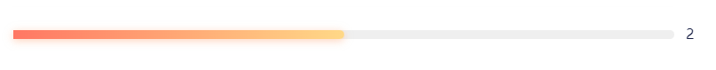

​		最近在项目开发中遇到CSS伪元素产生遮挡的问题，总结一下如何解决的。

* 产生场景
  
    

    如图所示，背景为**before**伪元素生成，进度条用本身元素，通过控制宽度来改变进度。
    
    灰色的层级（伪元素生成）会覆盖在彩色层级（本身元素）之上。
    
    可以通过
    
    1. 设置index
    ```
       ::before{
       	z-index:-1
       }
    ```
    
    2. 设置transform
    ```
       #target{
       	transform-style: preserve-3d;
       }
       #target::before{
       	transform:translateZ(-1px);
       }
    ```

