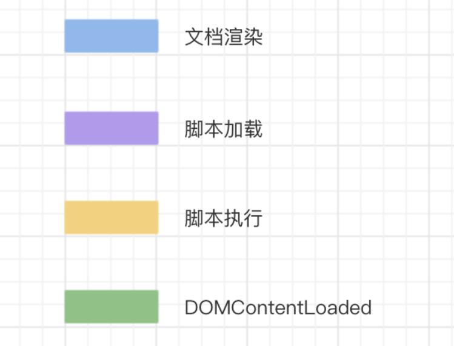
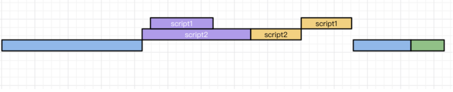
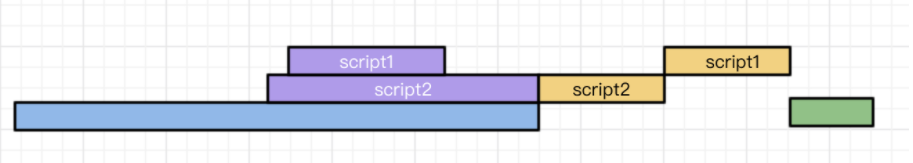
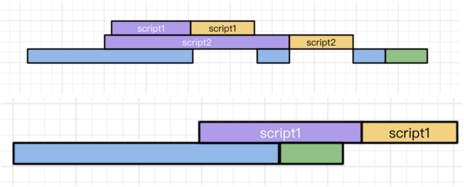

● 普通script
文档解析的过程中，如果遇到script脚本，就会停止页面的解析进行下载。资源的下载是在解析过程中进行的，虽说script1脚本会很快的加载完毕，但是他前边的script2并没有加载&执行，所以他只能处于一个挂起的状态，等待script2执行完毕后再执行。当这两个脚本都执行完毕后，才会继续解析页面。

● defer
文档解析时，遇到设置了defer的脚本，就会在后台进行下载，但是并不会阻止文档的渲染，当页面解析&渲染完毕后。会等到所有的defer脚本加载完毕并按照顺序执行，执行完毕后会触发DOMContentLoaded事件。

● async
async脚本会在加载完毕后执行。async脚本的加载不计入DOMContentLoaded事件统计，也就是说下图两种情况都是有可能发生的

● 总结
  ○ 依赖页面中dom的话可以用defer
  ○ 不依赖页面中dom话可以用async