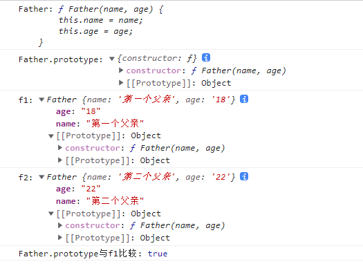

​		今天阳光明媚，风和日丽，就简单来总结一下原型链吧。

​		原型链是前端面试中（社招或者校招）都会出现的比较高频的面试点了，一定要掌握。

* prototype和__proto__
    大家在开发中会经常看到这两个东西，那么这两个东西是啥呢？
    prototype是显式原型，__proto__是隐式原型。
    而构造函数的prototype与实例的__proto__指向的那个对象叫做原型对象。

    ```
    function Father(name, age) {
        this.name = name;
        this.age = age;
    }
    var f1 = new Father("第一个父亲", "18");
    var f2 = new Father("第二个父亲", "22");
    console.log("Father:",Father);
    console.log("Father.prototype:",Father.prototype);
    console.log("f1:",f1);
    console.log("f2:",f2);
    ```

    

    从上图的代码执行结果来看，我们可以看出Father.prototype与实例f1/f2的指向都是同一个地方

    PS:实例对象的[[prototype]]与__proto__其实是一个东西

    - 

