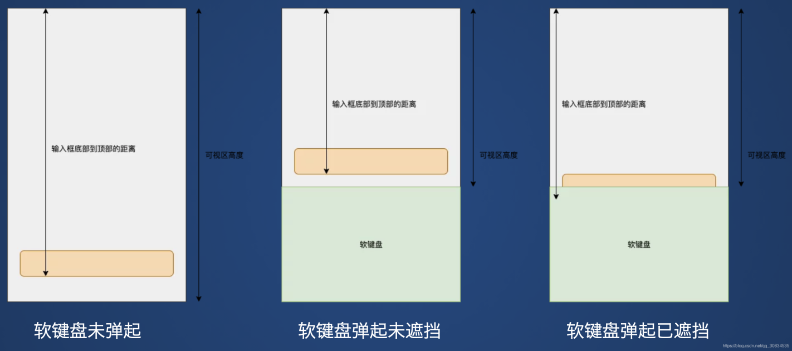

---
title: 移动端软键盘弹起遮挡输入框问题的解决方案
date: 2021-09-26 23:15:11
tags:
---

1. 背景
原生app与H5页面混合开发时，input输入框唤起软键盘时，输入框被遮挡，分为两种情况：

客户端设置了windowSoftInputMode ="adjustResize"属性，软键盘会将webview向上抬起，偶现input框被遮挡
客户端未设置windowSoftInputMode ="adjustResize"属性，软键盘在webview上方，不会将webview抬起，一直遮挡input的输入框
针对情况1的解决方案
当webview可以被抬起时，是可以监听到resize事件的，resize事件触发，判断input框是否在可视区内，在可视区内不做变动，否则计算距离后上移

监听resize事件

```
let originHeight = document.documentElement.clientHeight || document.body.clientHeight;
window.addEventListener('resize',  () => { // resize事件监听，webview高度是否发生变化
     //加了0.3s延时，等到键盘完全弹起时在判断是否被遮挡
    setTimeout(() =>{
        this.solveCoverWays();
    }, 300)
   
    let resizeHeight = document.documentElement.clientHeight || document.body.clientHeight;
    if (originHeight < resizeHeight) {
        if(this.scrollTopHeightVal != 0) {
            // 触发滑动，键盘下移时，页面回滚
            document.documentElement.scrollTop = -this.scrollTopHeightVal
            this.scrollTopHeightVal = 0
        }
    }
    originHeight = resizeHeight;
}, false)
```

2.是否被遮挡判断



```
solveCoverWays() {
    // 获取input元素底部bottom及整体高度
    let inputHeight = document.getElementById("inputHeight");
    let inputInfo = window.getComputedStyle(inputHeight, null);
    let inputInfoH = parseInt(inputInfo.height.replace('px',''))

    // 获取文档当前聚焦的元素
    const { activeElement } = document;
    if (!['INPUT', 'TEXTAREA'].includes(activeElement.tagName.toUpperCase())) return;
    const rect = activeElement.getBoundingClientRect();
    if (!rect) return;

    // 设置初始滑动高度 ，聚焦元素到顶部的距离减去可视区的高度，如果大于0，就说明被遮挡住了，此时需要滚动到可视区内
    let scrollHeight = 0
    scrollHeight = rect.bottom  - (document.documentElement.clientHeight || document.body.clientHeight);

    // 判断当前focus的input底部是否在document.body可视区域内
      if (scrollHeight > 0) {
   document.body.scrollTop = scrollHeight + inputInfoH;
   document.documentElement.scrollTop = scrollHeight + inputInfoH;
   this.scrollTopHeightVal = scrollHeight + inputInfoH;
      }
}
```

注意：这里实现的前提是客户端设置了相关属性，可以监听到resize事件
针对情况2的解决方案
大致计算软键盘的高度，在input的聚焦时，手动将整体加个padding，失焦时去掉padding，但是键盘抬起时，页面滑动效果不好
